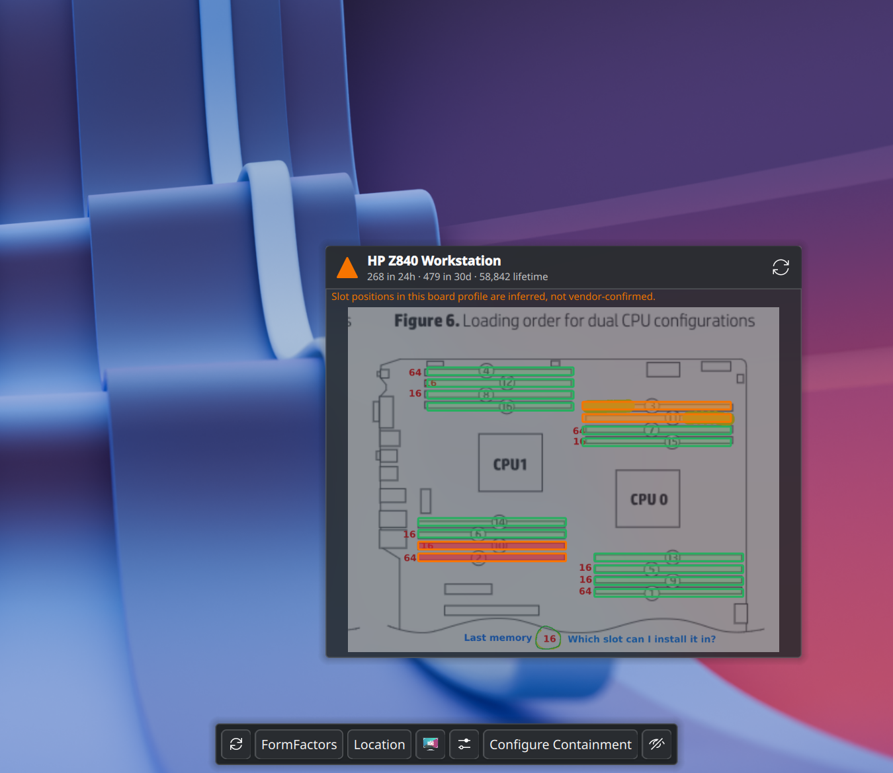

# Plasmoid Hardware Map

A Plasma 6 system-tray widget that shows the health of your machine's hardware
**on a picture of your actual motherboard** — ECC errors per DIMM, PCIe link
widths per slot, drive SMART status per connector, fan speeds, and temperatures.

It sits quietly in the tray and only asks for attention when something changes.



## Why

Most hardware monitors give you a number. A number is useless if you do not
already know what it counts, and worse than useless if it cannot tell you
*which physical part* to go and touch.

This shows you the part. Hover a DIMM slot and it names the module by its
silkscreen label and serial. Hover a PCIe slot and it tells you whether the card
trained at full width — and if not, whether that is the board's wiring (moving
the card is the only fix) or a physical-layer problem (reseat it). Hover a SATA
connector and you get the drive's SMART counters, and whether any of them have
*moved* since the drive was first seen.

Every reading is labelled with what it means. There are no bare integers.

## What it monitors

| Kind | Source | Notable |
|---|---|---|
| **Memory** | rasdaemon DB + EDAC sysfs | Per-DIMM corrected/uncorrectable ECC, windowed 24 h / 7 d / 30 d. Splits errors *proven* to a module from errors merely *shared* with its channel neighbour. |
| **PCIe slots** | sysfs + AER counters | Current vs maximum link width and speed, distinguishing board wiring from a bad link. Reports drives behind carrier cards and HBAs. |
| **Drives** | `smartctl` | Health verdict plus reallocated / pending / uncorrectable / CRC counters, NVMe endurance and media errors. Alarms on **growth**, not on old static scars. |
| **Storage connectors** | ATA ports, SAS PHYs | One component per physical connector, which inherits the health of whatever is plugged into it. |
| **Fans & temperatures** | hwmon | Each fan graded against its own siblings, so a fan lagging its pair is visible. |
| **Network ports** | sysfs | Link state and speed per physical port. |

Without a board picture it still works everywhere — it falls back to a grouped
list of everything it discovered. The picture is a convenience layer.

## Install

```sh
git clone https://github.com/<org>/plasmoid_hardware_map
cd plasmoid_hardware_map
./install.sh
```

Then right-click the panel → *Configure System Tray* → *Entries* and set
**Board Health Monitor** to Shown or Auto.

### Why there are two halves

Reading ECC history needs root: `rasdaemon`'s database is mode `0700`, and
`dmidecode` needs raw memory access. Rather than give a desktop widget those
privileges, a small root **collector** runs from a systemd timer and writes a
world-readable snapshot to `/run/dimm-mce/state.json`. The widget only ever
*reads that file*. It needs no sudo rule, no polkit action, and no privileges of
its own.

This means **installing the widget alone is not enough** — from the KDE Store or
otherwise, you also need the collector. `install.sh` sets up both. If the
snapshot is missing the widget says so and points here.

`rasdaemon` is strongly recommended; without it, error history does not survive
a reboot:

```sh
sudo dnf install rasdaemon && sudo systemctl enable --now rasdaemon
```

## Adding your own motherboard

The widget ships with one board profile as an example. Adding yours means
supplying a picture and dragging a box over each component:

```sh
./tools/calibrate.py ~/my-board.png
```

Physical geometry appears **nowhere** in SMBIOS — there is no field for "where
this slot sits on the board" — so inventory is automatic and geometry is manual
and shareable. See [AGENTS.md](AGENTS.md) for the full guide, the profile
format, and the traps worth knowing before you trust a mapping.

Board profiles are welcome as pull requests.

## Honesty about inference

Some mappings cannot be derived, only guessed — notably which silkscreened DIMM
belongs to which EDAC channel, because nothing in firmware connects the two. A
profile declares its `confidence`, and anything inferred is labelled as inferred
in the UI rather than presented as fact.

A wrong guess sends someone to pull the wrong stick. That is the failure mode
this project cares most about avoiding.

## Requirements

- Plasma 6 / Qt 6
- `smartmontools` for drive health
- `rasdaemon` for persistent ECC history (recommended)
- `dmidecode` for module identity
- Linux with EDAC support for ECC memory

## Licence

GPL-2.0-or-later. See [LICENSE](LICENSE).

The bundled example board profile includes imagery of an HP Z840 mainboard;
see [boards/hp-z840/README.md](boards/hp-z840/README.md) for its provenance and
redistribution status.
